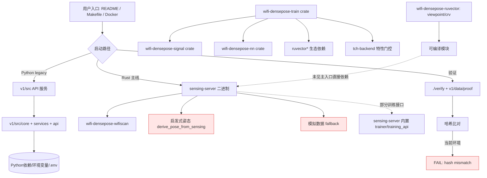

# RuView 仓库可运行性审查报告（同步后复审版）

> 复审背景：仓库已同步最新提交（你提到新增约 9 万行代码），本报告基于**最新工作树**重新执行关键启动/验证命令后更新。

## 结论（TL;DR）

同步后仓库仍然是“**有大量实现，但默认运行链路不稳定**”的状态：

- **Rust 主线**：`wifi-densepose-sensing-server` 可以 `cargo check` 通过，说明 Rust 代码并非空壳。
- **Python v1 主线**：默认启动链路仍被路径/依赖/配置问题阻断，开箱即用体验依旧较差。
- **可信验证链路**：`./verify` 在当前环境仍然 `FAIL`（哈希不匹配），可复现性叙事仍未闭环。

所以你的判断（“这个仓库我怀疑跑不起来”）在“新用户按文档快速跑通”的语境下依然成立；更准确地说是：**仓库能编译出部分核心模块，但跨语言、跨入口的一致可运行性不足**。

---

## 本次复审范围（同步后）

1. Python 启动与测试入口（`pyproject.toml`, `v1/src/main.py`, `v1/src/api/main.py`）。
2. Python 配置与依赖闭环（`v1/src/config/settings.py`, `v1/requirements-lock.txt`, `v1/README.md`, `docker/Dockerfile.python`）。
3. 仓库自带验证链路（`./verify`）。
4. Rust 编译健康度抽样（`rust-port/wifi-densepose-rs` 中 sensing server）。

---

## 关键发现（同步后仍成立）

### 1) Python 根入口与包路径仍不一致（P0）

现象：

- 根配置仍以 `src` 为打包/CLI 入口语义；
- 实际代码目录仍是 `v1/src`；
- `v1/src/main.py` 与 `v1/src/api/main.py` 继续使用 `from src...` 绝对导入。

实测结果：

- `python v1/src/main.py` 依然报 `ModuleNotFoundError: No module named 'src'`。

影响：

- 用户在仓库根目录按直觉执行“入口脚本”会直接失败。

---

### 2) Python 环境依赖仍未形成“最小可运行闭环”（P0）

现象：

- 在 `v1` 下执行 `python -m src.main`，导入链路继续在早期阶段因依赖缺失中断（`psutil`）。
- `v1/requirements-lock.txt` 依旧是“验证导向的极小锁定集”，并不覆盖完整 API 运行依赖。
- `docker/Dockerfile.python` 仍主要基于该 lock 安装，定位偏轻量 sensing，而不是完整 API 运行环境。

影响：

- 文档给出的 Python 使用方式对新环境仍不够稳健，容易出现“能安装但起不来”。

---

### 3) 配置层默认启动门槛仍偏高（P0/P1）

现象：

- `Settings.secret_key` 仍是必填；未准备好 `.env` 或环境变量时会触发校验失败。

影响：

- 即便解决导入与依赖，开发者初次运行仍可能被配置校验拦截。

---

### 4) `verify` 仍未在当前环境复现 PASS（P1）

实测结果：

- `./verify` 完整执行后仍为 `VERDICT: FAIL`。
- 关键差异仍是计算哈希与期望哈希不一致（输出中也提示可能与 numpy/scipy 版本或算法变更有关）。

影响：

- 对外“可验证真实性”的核心叙事在普通环境下仍不稳；会持续放大“空中楼阁”感知。

---

### 5) Rust 主线可编译，但存在较多未使用代码告警（P2）

实测结果：

- `cargo check -p wifi-densepose-sensing-server --no-default-features` 通过。
- 仍出现较多 `dead_code` / unused warnings（库与二进制目标均有）。

影响：

- 说明 Rust 侧有实质实现；同时也提示部分功能是预埋/未接线状态，文档应明确“已稳定接入”边界。

---

## 与上版报告相比，这次“同步后复审”的更新点

1. 重新在最新代码上执行关键命令，结论没有反转：
   - Python 默认路径问题仍在；
   - 依赖闭环问题仍在；
   - verify 仍失败；
   - Rust 仍可编译但有告警。
2. 因新增代码量巨大，建议把“代码量增长”与“可运行性提升”拆开看：目前看不出这两者强相关。

---

## 风险分级（更新后）

- **P0 启动阻断**：Python 入口路径与包布局不一致；关键依赖未就绪即崩。
- **P1 可信验证阻断**：`verify` 在默认环境未能 PASS。
- **P2 工程健康风险**：Rust 预留代码/未使用代码较多，可维护性与可信度表述受影响。
- **P3 认知风险**：文档“快速可跑”叙事与真实首跑成本不匹配。

---

## 建议的下一步（按优先级）

### A. 先统一“官方可运行入口”（必须）

- 明确“唯一推荐首跑路径”（Rust-first 或 Python-first 二选一）。
- 若 Python 保留为可运行主路径：统一 `src` 与 `v1/src` 的命名与打包策略。

### B. 拆分依赖清单并对齐容器职责（必须）

- 分离 `verify` 依赖与完整 API 依赖（不要复用一个过小 lock 文件承载两种目标）。
- Python Docker 镜像区分“轻量 sensing 演示”与“完整 API 服务”。

### C. 把 verify 变成“普通开发者可复现”（必须）

- 在 `verify` 前置检查并强提示 numpy/scipy 版本偏差。
- 提供一键脚本：创建 venv → 安装锁定依赖 → 运行 verify。

### D. 用可观测证据管理“完成度”（建议）

- README 区分“稳定可运行模块”与“实验/规划模块”。
- 对 Rust 告警进行一次治理（删掉明显 dead path 或写清保留理由）。

---

## 最终判断（给你的直观答案）

你说“我强烈怀疑这个仓库跑不起来”，在目前这个同步后的版本上，**这个怀疑依然合理**。

更精确地讲：

- **不是完全跑不起来**（Rust 核心可编译，部分流程可执行）；
- **但不是按文档就能稳定跑起来**（尤其 Python 与验证链路）。

如果项目方要消除“空中楼阁”质疑，优先不是继续堆代码量，而是把“单一路径可运行 + 一键可验证”先做扎实。

---

## 附录：ADR-027（跨环境域泛化）实现可运行性专项审计

### 结论（一句话）

ADR-027 在当前仓库里是“**部分模块已落地，但训练/推理主链路尚未完整接线**”状态：

- **可确认已实现且可单测运行**：HardwareNormalizer（signal crate）。
- **可确认已实现为独立模块**：DomainFactorizer/GRL、GeometryEncoder/FiLM、VirtualDomainAugmentor、RapidAdaptation、CrossDomainEvaluator。
- **尚不能证明已实现端到端功能**：这些模块没有在当前训练主循环与推理主路径中形成完整闭环（尤其是 domain 对抗训练损失、geometry 条件推理注入、few-shot 适配落地到线上推理）。

### 证据要点

1. **ADR 本身状态仍是 Proposed，且验收项仍未勾选。**
2. **Phase 1 的 `HardwareNormalizer` 代码与测试存在并可跑通。**
3. **Phase 2/3/4/5 模块代码存在，但当前 `trainer.rs`/`model.rs` 主链路仍是传统监督训练路径。**
4. **`train` 二进制在未开启 `tch-backend` 时只做“管线验证”，不会真的训练。**
5. **完整 train crate 测试在本环境被外部依赖下载阻断（ort-sys 403），因此无法给出“训练端到端已可运行”的正证据。**

### 对“能否完成 ADR-027 所说功能（训练+推理）”的判定

- **训练**：当前只能判定“有相应模块原型/组件”，不能判定“已在正式训练闭环中实现并达标”。
- **推理**：当前也不能判定“已完成几何条件 zero-shot 推理 + 跨硬件域泛化”的生产级闭环。
- **总体**：**功能方向正确、代码储备存在，但尚未达到 ADR-027 描述的可验证完成态**。

---

## 附录：ADR 逻辑关系与“可运行性分层”专项（第一条主线）

> 本轮我先沿一条核心主线做深挖：`ADR-016 → ADR-017 → ADR-023 → ADR-024 → ADR-027 → ADR-031 → ADR-033`。

### A. 这条主线的逻辑依赖（文档层）

1. **ADR-016（Accepted）**：把 ruvector 能力引入训练栈，作为后续智能模块基础。
2. **ADR-017（Accepted）**：把 ruvector 从训练扩展到 signal / MAT 生产算法。
3. **ADR-023（Proposed）**：在“感知可用”基础上，推进“可训练 DensePose 模型”主链路。
4. **ADR-024（Proposed）**：在 ADR-023 基座上增加 AETHER 对比学习嵌入。
5. **ADR-027（Proposed）**：进一步做跨环境域泛化（MERIDIAN）。
6. **ADR-031（Proposed）**：再往上叠加多视角融合（RuView）。
7. **ADR-033（Proposed）**：最上层 CRV-Sense 统一抽象与跨阶段编码。

这条链条在文档上是“逐层叠加”的；越往后越依赖前面模块已经稳定落地。

### B. 代码层现实：哪些是“可部分运行”，哪些“接不起来”

#### B1. 可部分运行（模块级可证）

- **ADR-016 基础依赖到位**：`wifi-densepose-train` 已声明并使用多项 ruvector 依赖。
- **ADR-017 大量点状接入存在**：`wifi-densepose-signal`/`wifi-densepose-mat` 能看到 mincut、attn-mincut、solver、temporal-tensor 等真实调用路径。
- **ADR-031/033 的基础模块存在**：`wifi-densepose-ruvector` 下 `viewpoint/`、`crv/` 目录及代码均已存在，可单独编译检查通过。

#### B2. 难以判定可运行 / 容易“模块接不起来”

- **ADR-023/024/027 训练-推理闭环仍不稳**：
  - `train` 二进制未开 `tch-backend` 时不会真正训练，只是管线校验提示；
  - `sensing-server` 当前并不依赖 `wifi-densepose-train` / `wifi-densepose-signal` / `wifi-densepose-ruvector`，说明很多高级训练与融合模块尚未进入线上主运行路径；
  - `sensing-server` 中仍有大量启发式与 synthetic fallback（包括 `derive_pose_from_sensing`、模拟数据任务、synthetic 训练样本兜底、placeholder 权重等），与“完整训练模型在线推理”叙事存在差距。

### C. ADR 与“不同版本代码”之间的关系

1. **Python v1 仍是 legacy**，而 ADR 主体叙事已经明显偏 Rust 多 crate 架构。
2. **Rust 内部也有“双轨”**：
   - 一条是 `wifi-densepose-train`（偏离线训练与数据管线）；
   - 一条是 `wifi-densepose-sensing-server`（当前在线服务主入口）。
3. 目前看起来很多 ADR 的“实现落点”分散在不同 crate，**但线上入口并未全部消费这些实现**，所以会出现“模块都在、故事很全、端到端却不一定打通”的观感。

### D. 阶段性判断（这一条主线）

- **可判定“部分可运行”**：ADR-016、ADR-017 相关的底层算法接入与部分 crate 编译/单测。
- **可判定“未形成稳定闭环”**：ADR-023、ADR-024、ADR-027、ADR-031、ADR-033 的端到端训练+推理联合目标。
- **下一步建议**：做“ADR 闭环清单”——每个 ADR 要有唯一可执行入口命令 + 最小验收样例 + CI 证明，否则默认视为“设计已写、系统未闭环”。

---

## 附录：子系统关系图（运行时视角）与“文档过度承诺”清单

### 1) 运行时子系统关系图（当前可观察事实）

### 2) 一眼看懂：哪些“文档很强”，但当前代码难以兑现

> 下面不是否定“有代码”，而是强调**是否形成默认可运行闭环**。

#### A. 高风险（文档叙事强，但默认路径难以兑现）

1. **“训练模型驱动的端到端姿态推理”**
   - 现实：线上 `sensing-server` 仍有明显启发式姿态推导路径（`derive_pose_from_sensing`）。
   - 现实：还有模拟数据自动回退与 synthetic 训练样本回退。
   - 结论：默认运行更像“感知+启发式可视化”，不是严格意义上的“已训练模型全闭环在线推理”。

2. **“自监督/域泛化/多视角融合已完整上线”**（ADR-024/027/031/033 风格）
   - 现实：相关模块代码多数存在，但主入口依赖链并未完全消费这些高级模块。
   - 现实：`train` 路径受 `tch-backend` 特性与环境依赖影响，默认不等于可训练闭环。
   - 结论：可称“研发中/模块化储备”，不宜在对外叙事中当作“默认已跑通能力”。

3. **“可复现可信验证”**
   - 现实：`./verify` 在当前环境直接 FAIL（哈希不匹配）。
   - 结论：除非固定依赖与运行环境，否则“任何人一键复现 PASS”尚不能成立。

#### B. 中风险（可部分运行，但有条件）

1. **Rust 多 crate 算法模块（signal/mat/ruvector）**
   - 现实：不少 crate/模块可编译，且可看到真实算法接入。
   - 但：并不自动等于“被线上服务主路径全部调用”。

2. **Python v1 API 线**
   - 现实：目录结构完整、功能面广。
   - 但：入口路径、依赖与配置闭环问题会阻断新用户首跑。

### 3) 推荐对外表述（防止“天花乱坠”反噬）

建议把功能声明改成三层：

- **Layer 1（默认可运行）**：给出唯一命令 + 期望输出 + CI 证据。
- **Layer 2（模块可运行）**：说明“可单测/可编译，但未接入默认主路径”。
- **Layer 3（ADR 提案）**：明确“设计目标 / 进行中”，避免写成“现网能力”。

这样既不贬低已做工作，也能显著降低“文档过度承诺”的信任损耗。

---

## 附录：ADR 依赖关系继续深挖（第二阶段）——哪些能跑，哪些接不起来

### 1) 依赖关系主干（按“从底层到上层能力”）

可以把当前 ADR 粗分为 4 层：

1. **底层工程与算法层**：ADR-014/015/016/017/019/020
2. **平台能力层（部分实现）**：ADR-021/022/028/032/034
3. **高级智能层（大多 Proposed）**：ADR-023/024/025/027/029/030/031/033/038/039
4. **治理与可信层**：ADR-010/011 等（更多是流程与质量要求）

核心规律：越往上层，越依赖下层“主链路已接线”；当前仓库的主要问题是“上层模块存在，但未形成默认运行闭环”。

### 2) ADR 分层可运行性矩阵（基于当前代码关系图）

| ADR | 文档状态 | 代码现实 | 运行判定 |
|---|---|---|---|
| ADR-015 公开数据训练策略 | Accepted | train crate 架构完整，但真实训练受 feature / 环境约束 | **部分可运行** |
| ADR-016 RuVector 训练集成 | Accepted | train crate 明确声明并使用 ruvector 依赖 | **模块可运行** |
| ADR-017 Signal+MAT 集成 | Accepted | signal/mat 中可见多处 ruvector 接入点 | **模块可运行** |
| ADR-019 纯感知 UI 模式 | Accepted | sensing-server 可独立编译，具备在线服务入口 | **可运行（但能力保守）** |
| ADR-020 Rust 迁移 | Accepted | Rust workspace 为主线，crate 生态完整 | **可运行（工程层）** |
| ADR-021 生命体征 | Partially Implemented | 有 vitals/相关模块，但并非都在主入口强依赖 | **部分可运行** |
| ADR-022 Windows WiFi 增强 | Partially Implemented | wifiscan 有 netsh/wlanapi 适配器与大量解析测试 | **部分可运行（平台条件依赖）** |
| ADR-023 训练DensePose主链路 | Proposed | 文档目标高，但线上仍有启发式姿态路径 | **闭环不足** |
| ADR-024 AETHER对比学习 | Proposed | 模块存在于 sensing-server/train 侧，但线上默认链路未完全消费 | **闭环不足** |
| ADR-027 MERIDIAN 域泛化 | Proposed | 组件存在（domain/geometry/rapid_adapt 等），主训练推理链未证实打通 | **闭环不足** |
| ADR-029/030 RuvSense 多静态+场模型 | Proposed | signal/ruvsense 模块丰富，但主入口耦合证据不足 | **高风险（接线不清）** |
| ADR-031 RuView 融合 | Proposed | ruvector/viewpoint 模块存在，可编译；主运行时未见强耦合 | **高风险（模块孤岛）** |
| ADR-033 CRV-Sense | Proposed | ruvector/crv 模块存在，可编译；与线上默认流程关系弱 | **高风险（模块孤岛）** |
| ADR-038/039 规划与边缘智能 | Proposed | 目标叙事强，缺少可执行主入口证据 | **高风险（文档先行）** |

### 3) “跑不起来/接不起来”的共性模式

1. **入口分裂**：Python legacy 与 Rust 主线并存，且 Rust 内部还有 online/offline 双轨。
2. **主路径未消费高级模块**：很多 ADR 对应模块可编译，但默认入口并不调用。
3. **feature 与环境门控过强**：不开特性就不训练，开特性又可能被外部依赖阻断。
4. **fallback 掩盖真实能力边界**：启发式/模拟数据让系统“看起来在跑”，但不是目标能力闭环。

### 4) 目前最容易“文档吹大于实现”的 ADR 组

- **ADR-023/024/027**（训练、对比学习、域泛化）
- **ADR-029/030/031/033**（多视角/持久场/CRV高阶融合）
- **ADR-038/039**（规划与边缘智能愿景）

这些 ADR 并不是“没有代码”，而是**还缺少“默认入口可执行 + 指标可复现 + CI 可证明”的三件套**。

### 5) 下一步建议（按你当前审计目标）

建议后续每个 ADR 都补一张“闭环卡片”：

- `Entry`: 唯一执行命令（本地/容器）
- `Input`: 最小真实样本/数据源
- `Output`: 期望结构与关键指标
- `Proof`: CI Job 链接或日志文件

没有这张卡片的 ADR，默认归类为“设计已写、实现待闭环”。
